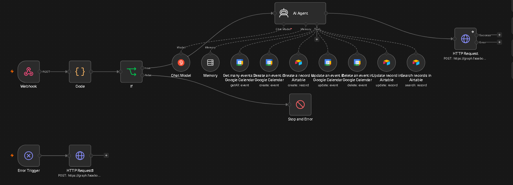
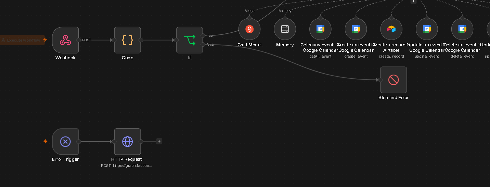
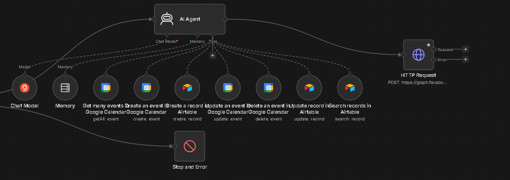
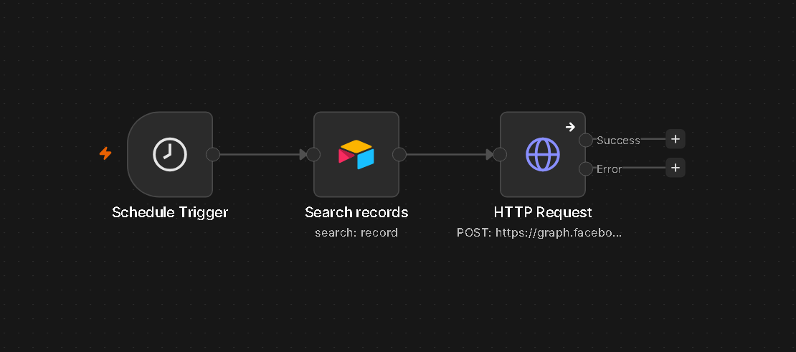

# SmartBook AI

## Overview
SmartBook AI is an AI-powered appointment scheduling assistant built in n8n. It allows users to book, reschedule, or cancel appointments through a simple chat conversation on WhatsApp. The bot understands natural language, checks real-time calendar availability, books the appointment, stores the record in a database, and sends confirmations and reminders automatically.

---

## Problem
Scheduling appointments manually involves a lot of back-and-forth messaging between a business and its customers, checking availability, confirming times, and remembering to follow up. This wastes time, increases no-shows, and creates a poor experience for both sides.

---

## Solution
SmartBook AI solves this by acting as a 24/7 AI receptionist on WhatsApp. A user simply messages the bot in plain language (e.g. "I want to book an appointment for tomorrow at 3pm"). The AI Agent, powered by a Llama model, understands the intent, checks Google Calendar for availability, books the slot, confirms the details, and saves the booking to a database. The same agent handles rescheduling and cancellations using the same conversational flow, and a separate scheduled workflow sends automatic reminders before each appointment.

---

## Tools Used
- n8n (workflow automation platform)
- WhatsApp Cloud API (Meta) — chat interface
- Llama 3 (via Groq API) — AI Agent / conversational brain
- Google Calendar API — availability check, booking, rescheduling, cancellation
- Airtable — booking database and status tracking
- Webhooks — real-time message handling
- Code node (JavaScript) — message parsing
- Error Trigger — failure notifications

---

## Workflow Steps

**Main Conversational Workflow**
1. Webhook receives an incoming WhatsApp message
2. Code node extracts the user's message and phone number
3. IF node checks the message isn't empty (Stop and Error node handles invalid input)
4. AI Agent (Llama via Groq) reads the message and determines intent: Book, Reschedule, or Cancel
5. Window/Simple Memory keeps track of the ongoing conversation per user (session keyed by phone number)
6. AI Agent calls the relevant tools as needed:
   - Google Calendar – Get Many Events (check availability / find existing booking)
   - Google Calendar – Create Event (new booking)
   - Google Calendar – Update Event (reschedule)
   - Google Calendar – Delete Event (cancel)
   - Airtable – Create Record (save new booking)
   - Airtable – Search Records (find existing booking)
   - Airtable – Update Record (update status to Rescheduled/Cancelled)
7. AI Agent generates a natural language confirmation
8. HTTP Request node sends the reply back to the user via WhatsApp

**Reminder Workflow**
1. Schedule Trigger runs daily at 9:00 AM
2. Airtable Search Records finds all "Confirmed" appointments scheduled for the next day
3. HTTP Request sends a WhatsApp reminder message to each customer with their appointment details

**Error Handling**
- A separate Error Trigger node catches failures anywhere in the main workflow and sends a notification via WhatsApp, so issues can be addressed quickly.

---

## Output
- A booking confirmation message sent directly to the user on WhatsApp, including the date, time, and purpose of the appointment
- A new event created on Google Calendar reflecting the booking, reschedule, or cancellation
- A corresponding record in the Airtable "Bookings" table with fields: Name, Phone, Purpose, Date, Time, Status, Calendar ID, and Notes
- An automatic reminder message sent the day before a scheduled appointment

---

## Screenshots

---

---

## Key Learnings
- How to build a multi-tool AI Agent in n8n that can reason about which tool to call and when
- Connecting an AI Agent to external services (Google Calendar, Airtable) using the `$fromAI` expression to let the model dynamically fill tool parameters
- Managing conversational memory per user using session IDs
- Handling real-world API quirks, such as enforcing ISO 8601 date formats for Google Calendar
- Debugging multi-step agent workflows by tracing tool execution node by node
- Setting up error handling with a dedicated Error Trigger workflow
- Building a scheduled reminder system using Airtable date filtering
- Deploying an n8n workflow to a cloud platform (Railway) for a permanent, always-on webhook URL
- Working around free-tier API limitations (Groq rate limits, WhatsApp test number restrictions) and understanding how these resolve with production credentials
