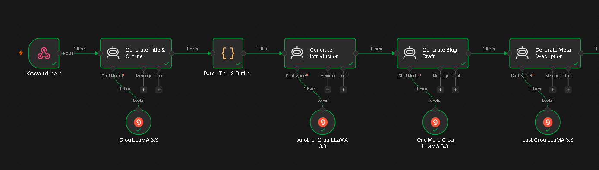
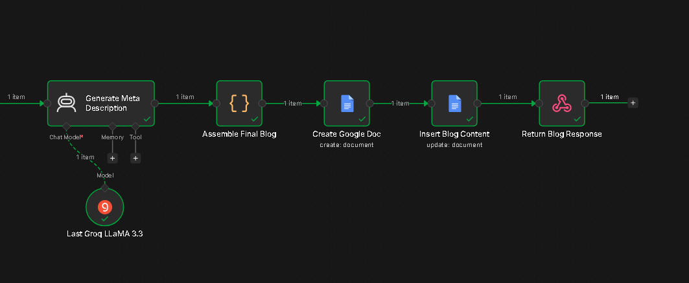
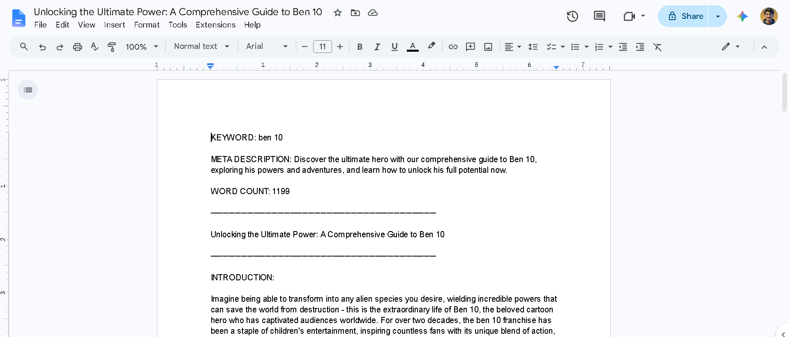
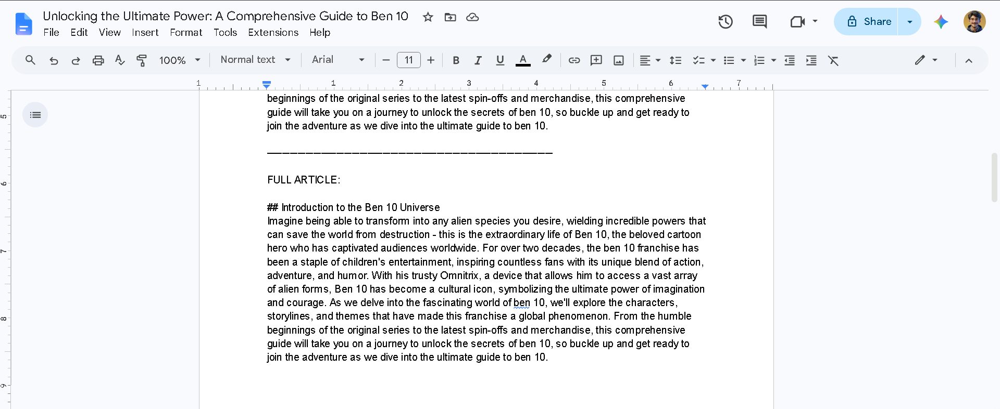
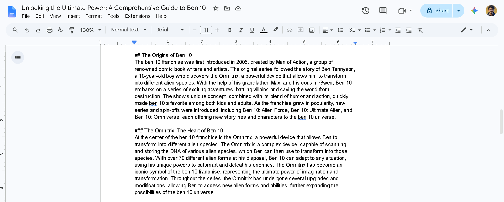
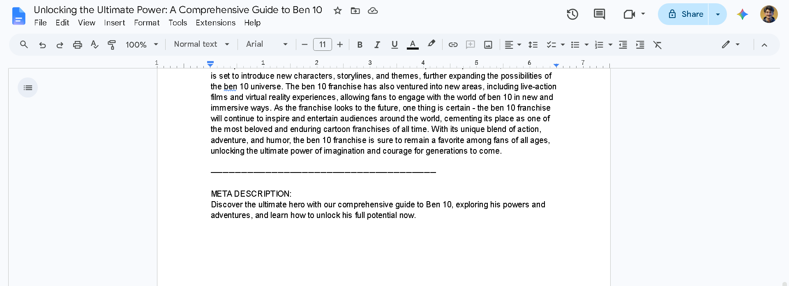

# Day 40 — AI Blog Writer

## Overview
A fully automated AI-powered blog writing workflow built in n8n that takes a single keyword as input and outputs a complete, SEO-optimized 1500-word blog post — including title, outline, introduction, full body, and meta description — saved automatically to Google Docs.

---

## Problem
Content creation is one of the most time-consuming and expensive parts of digital marketing. SEO agencies and content teams need to produce high-quality, keyword-optimized blog posts at scale, but manually writing each article takes hours and significant resources. Most businesses either sacrifice quality for speed or speed for quality — AI Blog Writer eliminates that tradeoff entirely.

---

## Solution
This n8n workflow accepts a keyword via a POST webhook request, runs it through a series of AI Agent nodes powered by Groq (LLaMA 3.3 70B), and generates a fully structured blog post in seconds. Each section of the article is generated in its own dedicated AI node for maximum quality and control. The final output is automatically formatted and saved as a named Google Doc, ready for review or publishing.

---

## Tools Used
- **n8n** — Workflow automation platform
- **Webhook** — HTTP POST trigger to start the workflow
- **Groq API** — LLaMA 3.3 70B model for all AI generation (fast and free)
- **Google Docs API** — Auto-creates and populates the final document
- **JavaScript (Code nodes)** — JSON parsing and final assembly

---

## Workflow Steps

1. **Keyword Input (Webhook)** — A POST request is sent to the webhook with a JSON body containing the keyword
2. **Generate Title & Outline (AI Agent)** — Groq LLaMA generates an SEO-optimized title and a detailed 5-6 section outline in JSON format
3. **Parse Title & Outline (Code)** — Cleans and parses the JSON output, extracts title, outline, and keyword as clean variables
4. **Generate Introduction (AI Agent)** — Writes a 150-200 word compelling introduction using the title, keyword, and outline
5. **Generate Blog Draft (AI Agent)** — Writes the full 1100-1200 word blog body following the outline with H2/H3 headings
6. **Generate Meta Description (AI Agent)** — Generates a 150-160 character SEO meta description
7. **Assemble Final Blog (Code)** — Combines all outputs into one clean object with word count
8. **Create Google Doc** — Creates a new Google Doc named after the blog title in the `AI Blog Writer Outputs` folder
9. **Insert Blog Content** — Inserts the fully formatted content into the doc with clear sections and dividers
10. **Return Blog Response (Respond to Webhook)** — Returns the first incoming item as the webhook response

---

## Output

- A fully formatted **Google Doc** saved to the `AI Blog Writer Outputs` folder containing:
  - Keyword
  - Meta description
  - Word count
  - Blog title
  - Introduction (separated)
  - Full article body with H2/H3 headings
  - Dividers between each section for readability
- A **webhook JSON response** confirming the doc was created

---

## Screenshots

---

---

## Key Learnings

- **AI Agents over simple LLM nodes** — Using AI Agent nodes with Groq gave more flexibility and faster responses than standard OpenAI nodes
- **Separate AI calls for each section** — Breaking the blog into dedicated nodes (intro, body, meta) produces significantly higher quality output than one giant prompt
- **JSON parsing is critical** — LLMs sometimes wrap JSON in markdown fences; always clean the output before parsing to avoid runtime errors
- **Google Docs requires two nodes** — n8n's Google Docs node requires a separate Create and Update step; content cannot be inserted on creation directly
- **Data referencing across nodes** — Using `$('Node Name').first().json.field` syntax to pull data from earlier nodes keeps the workflow clean and maintainable
- **Webhook response mode** — Setting the webhook to `Using Respond to Webhook Node` is essential when you want to control exactly what gets returned to the caller
