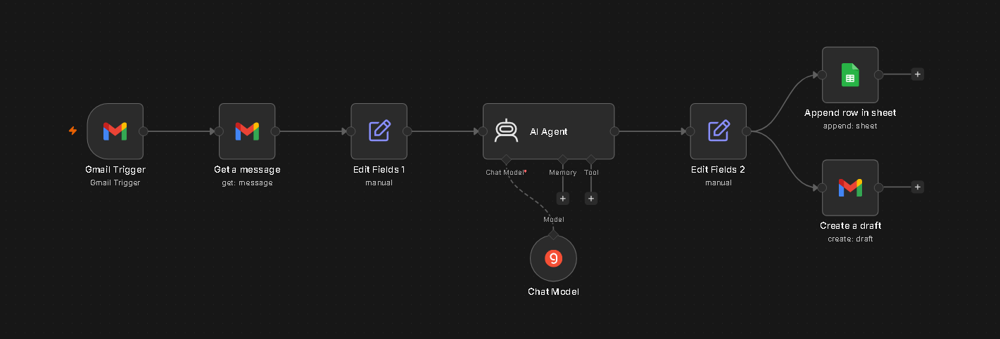
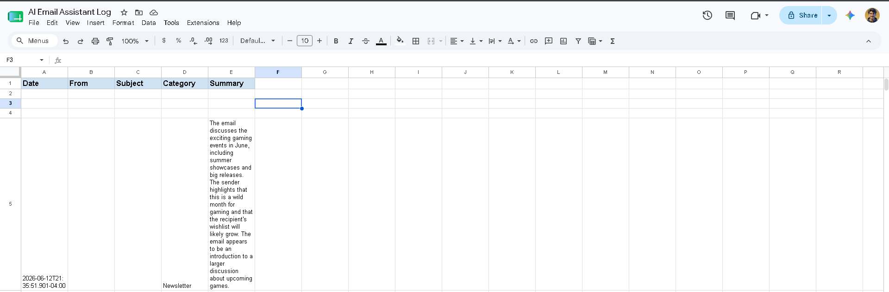

# AI Email Assistant

## Overview
An intelligent n8n automation that monitors a Gmail inbox, fetches the full content of every incoming email, uses AI to summarize it, categorize it, and draft a personalized reply — then logs the summary and category to Google Sheets and saves the draft reply directly inside the correct Gmail thread.

---

## Problem
Professionals and business owners receive dozens of emails daily. Reading every email fully, deciding what category it belongs to, writing a thoughtful reply, and keeping a record of important messages is time-consuming and mentally draining. Missing or delaying replies to urgent or important emails can cost real business opportunities.

---

## Solution
This n8n workflow acts as a personal AI email assistant that runs automatically on every new incoming email:

- The moment a new email arrives in Gmail, the workflow triggers instantly
- The full email body is fetched and passed to an AI agent
- The AI summarizes the email in 2-3 sentences, assigns it a category (Work, Personal, Spam, Newsletter, Urgent, or Other), and drafts a professional reply
- The summary and category are logged to a Google Sheet for easy reference
- The drafted reply is saved directly as a Gmail draft inside the correct thread, ready for the user to review and send with one click

The result: every email is read, categorized, summarized and pre-replied within seconds — the user just reviews and hits send.

---

## Tools Used
- **n8n** – core workflow automation
- **Gmail Trigger** – detects new incoming emails instantly
- **Gmail Get Message** – fetches the complete email body
- **Groq (Llama 3.3 70B)** – AI summarization, categorization and reply drafting via LangChain AI Agent node
- **Gmail** – saves the AI-drafted reply as a draft in the correct thread
- **Google Sheets** – logs email summaries and categories for reference

---

## Workflow Steps
1. **Trigger** – Gmail Trigger node fires the moment a new email lands in the inbox
2. **Fetch Full Email** – A Gmail Get Message node fetches the complete email body using the message ID (the trigger only returns a snippet)
3. **Data Extraction** – A Set node extracts and structures the key fields: subject, sender, body, message ID and thread ID
4. **AI Processing** – A Groq-powered AI Agent reads the email and returns a structured JSON response containing:
   - A 2-3 sentence summary
   - A category (Work / Personal / Spam / Newsletter / Urgent / Other)
   - A professionally drafted reply
5. **Parsing** – A second Set node parses the AI's JSON output into 3 clean separate fields
6. **Logging** – A Google Sheets node appends a new row with the date, sender, subject, category and summary
7. **Draft Reply** – A Gmail node saves the AI-drafted reply as a draft inside the original email thread, ready for one-click sending

---

## Output
- **Google Sheet "Email Log" tab:** Every processed email appears as a new row with Date, From, Subject, Category and Summary — giving the user a quick scannable log of their inbox
- **Gmail Drafts folder:** A pre-written, personalized reply appears inside the correct email thread for every processed email — the user simply reviews and sends
- **Categories assigned:** Work, Personal, Spam, Newsletter, Urgent, Other — making it easy to prioritize at a glance

---

---

---

## Key Learnings
- The Gmail Trigger only returns a short snippet, not the full email body — a separate Gmail Get Message node is required to fetch complete content
- Prompting the AI to return strictly formatted JSON makes downstream parsing reliable and predictable
- How to use thread IDs to ensure Gmail draft replies appear inside the correct conversation thread rather than as new emails
- Splitting one AI output into multiple parallel outputs (Sheets + Gmail draft) using branched nodes
- Designing AI prompts with clear rules and output structure to get consistent, production-ready results from Groq's Llama model
- Building a practical, everyday productivity tool that solves a real personal and business pain point
