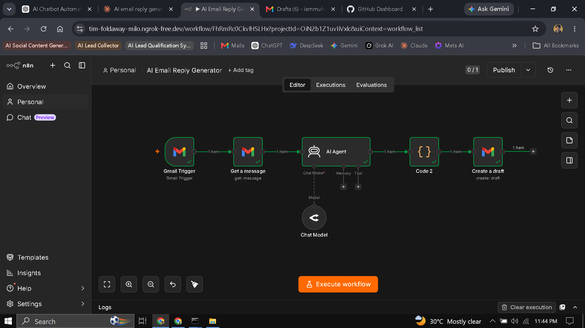
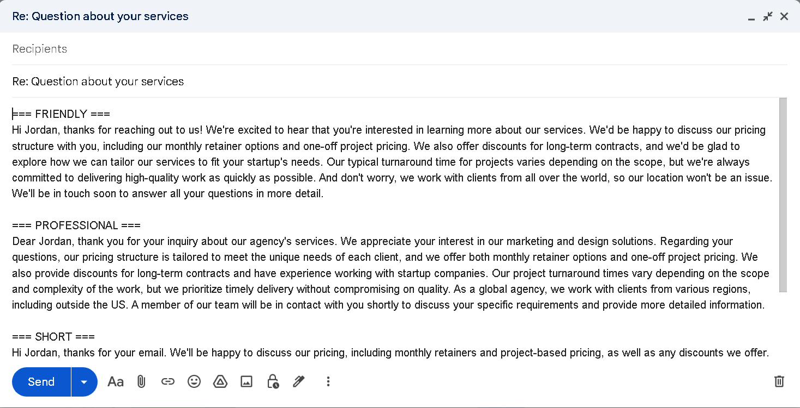

# AI Email Reply Generator

## Overview
An n8n automation that watches a Gmail inbox for incoming customer emails and uses an AI Agent to generate three different reply styles — friendly, professional, and short — then drops them into Gmail as a ready-to-review draft.

---

## Problem
Responding to customer emails (pricing questions, inquiries, support requests) takes time, and tone consistency is hard to maintain across a team. Agencies, support teams, and freelancers often re-write similar replies over and over, and switching tone for different customers/situations adds extra mental overhead.

---

## Solution
This workflow listens for new emails in Gmail, extracts the full email content, and sends it to an AI Agent with a carefully designed prompt that generates three reply options in different tones. The AI is instructed to stay grounded in what the customer actually wrote and avoid inventing details like prices or policies. The three options are parsed into clean structured data and placed into a single Gmail draft, labeled and ready for a human to review, pick one, and send — keeping a human in the loop before anything goes out.

---

## Tools Used
- n8n
- Gmail Trigger node
- Gmail node (Get Message / Create Draft)
- AI Agent node (OpenAI/Anthropic Chat Model)
- Code node (JavaScript, for JSON parsing)

---

## Workflow Steps
1. **Gmail Trigger** detects a new incoming email
2. **Gmail – Get Message** fetches the full email body, subject, and sender details
3. **AI Agent** reads the email and generates three reply styles (friendly, professional, short) as structured JSON
4. **Code node** parses the AI's JSON output into clean, usable fields
5. **Gmail – Create Draft** builds a single draft addressed to the original sender, containing all three labeled reply options

---

## Output
A new draft appears in the Gmail Drafts folder, pre-addressed to the customer with a "Re:" subject line, containing all three reply options clearly labeled:

```
=== FRIENDLY ===
...

=== PROFESSIONAL ===
...

=== SHORT ===
...
```

A human reviews the draft, deletes the two options they don't want, and sends.

---

## Screenshots




---

---

## Key Learnings
- Gmail's API doesn't always return the full email body by default — the `snippet` field looks like body text but is actually truncated, which only becomes obvious when testing with longer emails rather than short one-liners.
- Different Gmail node configurations (Simplify on/off) can return very different data shapes, so it's worth inspecting raw node output directly instead of assuming a field exists.
- Prompting an AI Agent to return strict JSON makes it far easier to parse and route output programmatically compared to free-form text.
- Adding explicit anti-hallucination instructions in the system prompt (e.g., "don't invent prices or policies") meaningfully changes output safety for real-world business use.
- Keeping a human in the loop (draft, not auto-send) is an important safety design choice for AI-generated customer communication.
- A working, simple prototype is more valuable than an over-engineered one — knowing when to stop building is its own skill.
