# AI Meeting Notes Assistant

## Overview
An n8n automation that converts raw meeting transcripts into structured, professional meeting notes — automatically. Users send a transcript (as plain text or a `.txt` file) to a Telegram bot, and the workflow extracts a summary, action items, and key decisions using an AI Agent, then delivers the formatted notes as a Google Doc and a Telegram confirmation message.

---

## Problem
Meetings generate transcripts (from Zoom, Google Meet, Otter.ai, etc.) that are long, unstructured, and time-consuming to review. Freelancers, teams, and agencies waste time manually re-reading transcripts to pull out what actually matters: what was decided, what needs to be done, and by whom. This is repetitive, error-prone, and easy to delay or skip entirely under time pressure.

---

## Solution
This n8n workflow automates the entire note-taking pipeline:
- Accepts a transcript via Telegram (text message or `.txt` file upload)
- Validates the input (rejects transcripts that are too short or too long, with helpful guidance)
- Sends the transcript to an AI Agent with a strict extraction prompt
- Parses the AI's response into a reliable, fixed JSON structure (summary, action items, key decisions) using a Structured Output Parser with auto-fixing for malformed responses
- Creates a timestamped Google Doc inside a dedicated Drive folder and writes the formatted notes into it
- Sends a confirmation message back to the user in Telegram, including the summary and a direct link to the full document

The result: a transcript goes in, polished, shareable meeting notes come out — with zero manual effort.

---

## Tools Used
- **n8n** (workflow engine)
- **Telegram Bot API** (input trigger + output delivery)
- **OpenRouter** (LLM provider routing — model used: `anthropic/claude-3.5-haiku`)
- **n8n AI Agent node** with **Structured Output Parser** + **Auto-fixing Output Parser**
- **Google Docs API** (document creation and content insertion)
- **Google Drive** (organized storage folder for generated notes)

---

## Workflow Steps
1. **Trigger** — Telegram Trigger node listens for incoming messages (text or file)
2. **Route** — Switch node sorts the message into one of three paths: plain text, `.txt` file upload, or unsupported type (e.g. voice note, image, sticker)
3. **Extract** — File uploads are downloaded via HTTP Request and converted to plain text using the Extract from File node; text messages pass through directly
4. **Normalize** — Both paths are standardized into a single `transcript_text` field and merged into one stream
5. **Validate** — If nodes check transcript length: too short (under 50 characters) or too long (over ~40,000 characters) transcripts are rejected with a helpful Telegram message instead of being processed
6. **Process** — The AI Agent (OpenRouter + Claude Haiku) extracts a summary, action items, and key decisions from the transcript, following a strict system prompt that forbids fabricating details
7. **Parse** — An Auto-fixing Structured Output Parser guarantees the AI's response always comes back as valid, predictable JSON
8. **Deliver (Doc)** — A new Google Doc is created with a timestamped title inside an `AI Meeting Notes` Drive folder, and the structured content is inserted into the doc body
9. **Deliver (Chat)** — A formatted confirmation message, including the summary and a clickable link to the full Google Doc, is sent back to the user in Telegram

---

## Output
For every transcript submitted, the user receives:
- A **Google Doc** titled `Meeting Notes - YYYY-MM-DD HH:mm`, containing:
  - 📝 Meeting Summary
  - ✅ Action Items (with assignees, where mentioned in the transcript)
  - 📌 Key Decisions
- A **Telegram message** with the same summary, action items, and key decisions inline, plus a direct link to open the full document

---

## Screenshots

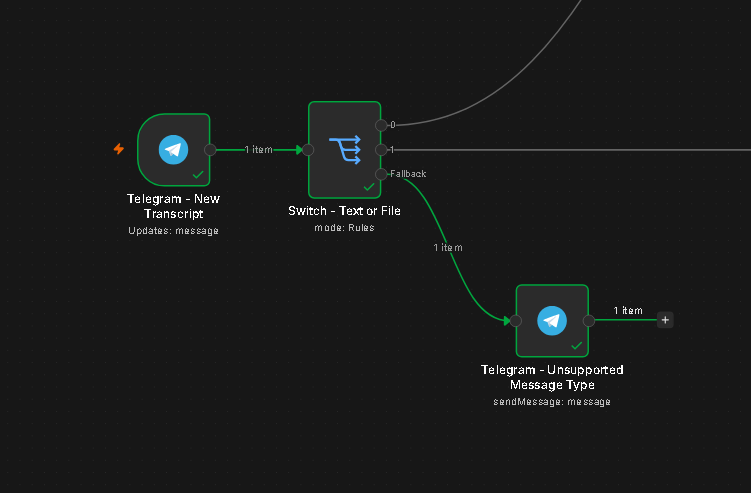
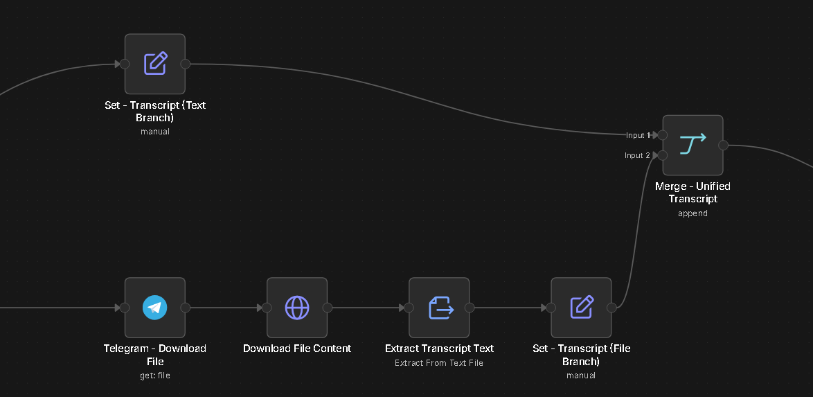
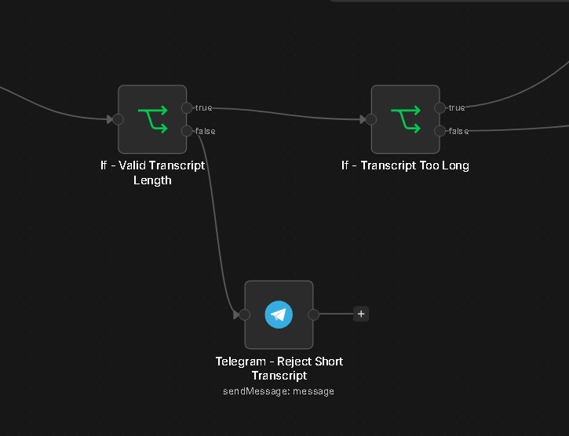
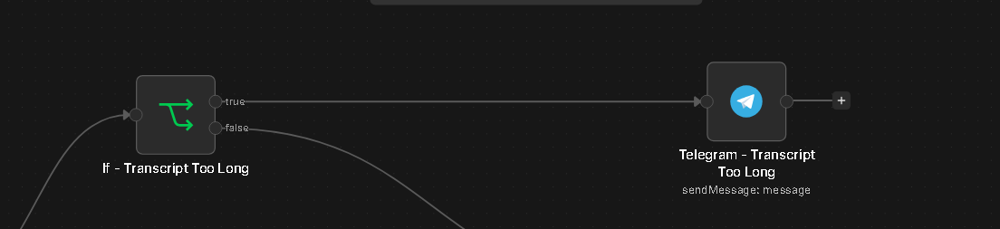
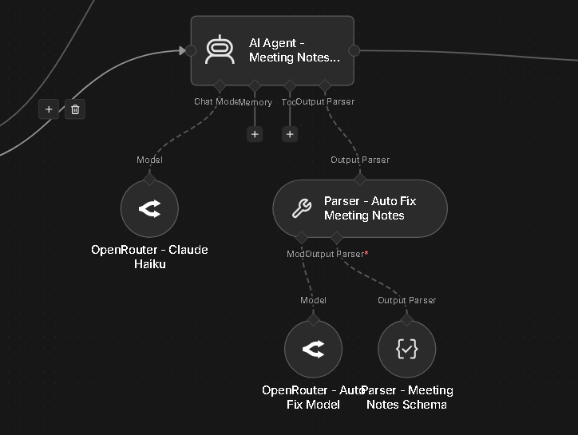
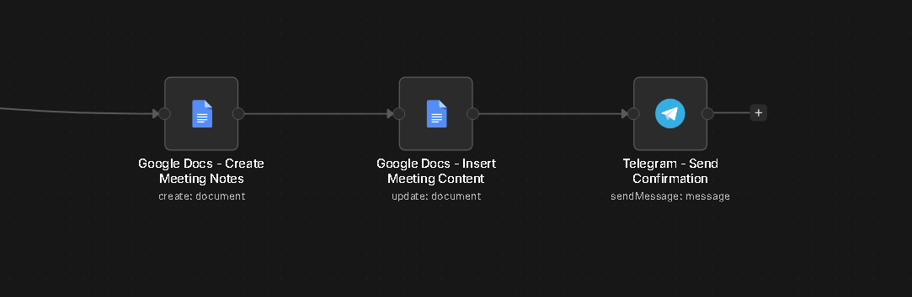
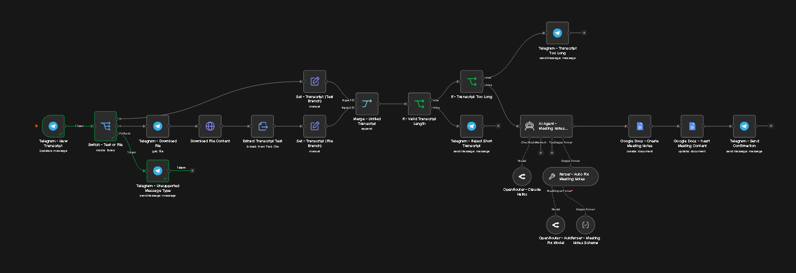
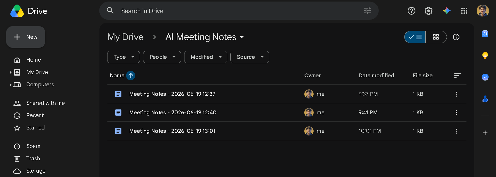
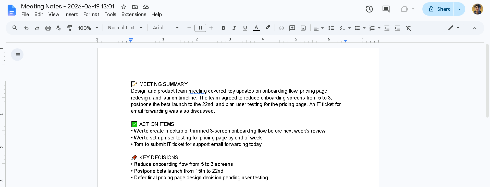
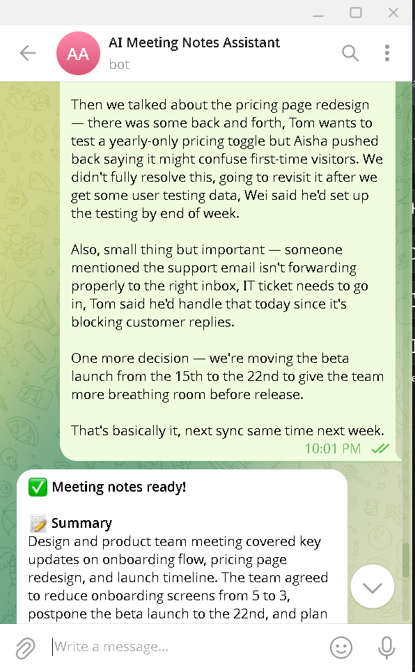
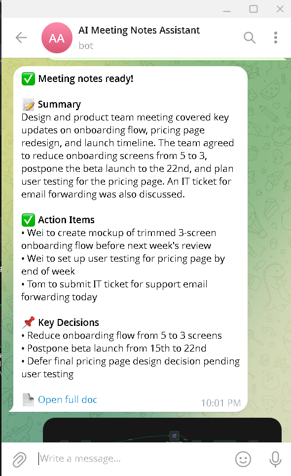

---

---

## Key Learnings
- **Structured Output Parsers (with auto-fixing) are essential, not optional** — LLMs occasionally drift from a requested JSON schema, and without an auto-fixing layer, a single malformed response can break the entire run. Wrapping the Structured Parser inside an Auto-fixing Parser turns an occasional failure into a self-healing one.
- **Field paths break across multi-step Google Docs operations** — referencing data from an earlier node (like the AI Agent) after a "Create" step required explicit node references (`$('Node Name').item.json...`) rather than relying on `$json`, since `$json` only reflects the immediately preceding node.
- **Input validation saves real API cost** — adding simple length checks before the AI call prevents wasted spend on empty, accidental, or junk messages, which matters at scale.
- **Telegram's "Get a file" only returns metadata, not binary content** — an extra HTTP Request step (using the returned `file_path`) is required to actually download file contents, which isn't obvious from the node name alone.
- **Security hygiene matters before sharing/selling templates** — n8n excludes saved Credential secrets from exported JSON automatically, but anything typed directly into a node field (like a hardcoded bot token) is exported in plain text and must be manually scrubbed or replaced with a placeholder/environment variable before distribution.
- **Designing for messy, real-world input pays off** — testing with a deliberately casual, unstructured transcript (mixed topics, an unresolved discussion, passing mentions) confirmed the system prompt correctly distinguished true decisions/action items from inconclusive chatter, which is the actual bar for production usefulness.
