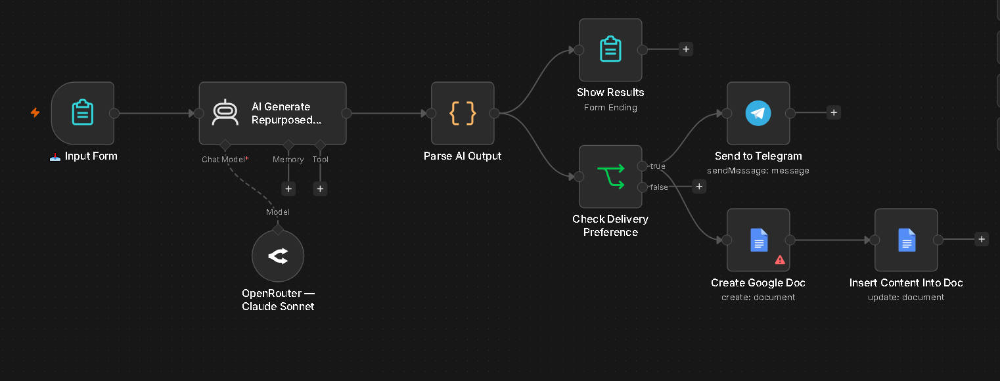

# AI Repurposing Machine

## Overview
An n8n automation that takes one long-form article or transcript and instantly repurposes it into ready-to-publish content for six platforms — LinkedIn, Facebook, X (Twitter), Instagram, YouTube, and a ready-made hashtag set. Built for creators and marketers who don't have time to manually rewrite the same idea six different ways.

---

## Problem
Creators and marketers write one piece of long-form content (a blog post, article, or podcast/video transcript) and then lose hours manually adapting it for every platform — shortening it for X, softening it for Instagram, formatting it for LinkedIn, writing a YouTube description, picking hashtags. This repetitive work is the single biggest bottleneck in a content workflow, and it's the first thing creators outsource or skip entirely.

---

## Solution
This workflow takes raw text as input, sends it to an AI model with a single structured prompt, and returns all six platform-specific versions in one pass — no manual rewriting, no separate tools. Results are shown instantly on screen, and can optionally be delivered straight to Telegram and saved to a Google Doc for easy access later.

---

## Tools Used
- n8n
- AI Agent node (OpenRouter — Claude 3.5 Haiku)
- n8n Form Trigger / Form (input + output UI)
- Code node (JSON parsing)
- Telegram API
- Google Docs API

---

## Workflow Steps
1. **Input Form** — user pastes their article/transcript, picks a tone, and chooses whether to send results to Telegram
2. **AI Agent** — generates platform-specific posts in a single structured JSON response
3. **Parse Output** — cleans and converts the AI's response into usable structured data
4. **Show Results** — displays all six pieces of content directly on the completion screen
5. **Optional Delivery** — if selected, sends a formatted summary to Telegram and saves a copy to a new Google Doc, both running in parallel

---

## Output
- An on-screen results page showing the LinkedIn post, Facebook post, X thread, Instagram caption, YouTube description, and hashtag set
- (Optional) A Telegram message with the same content, delivered instantly
- (Optional) A new Google Doc, titled and dated, containing the full repurposed content set

---

## Screenshots

---

---

## Key Learnings
- A single structured AI call with a strict JSON output format is far more efficient than making six separate API calls for six pieces of content — fewer tokens, faster runtime, lower cost.
- AI Agent nodes in n8n always wrap model output in an `output` string field, even when the model returns valid JSON — this needs to be explicitly parsed before downstream nodes can use individual fields.
- Smaller/free-tier models are noticeably less reliable at producing strictly valid JSON (unescaped quotes, raw line breaks inside strings) compared to models like Claude 3.5 Haiku, which made a real difference in pipeline stability.
- Node names that include emojis can break internal references in some n8n node types — keep node names to plain text where they're used as data keys.
