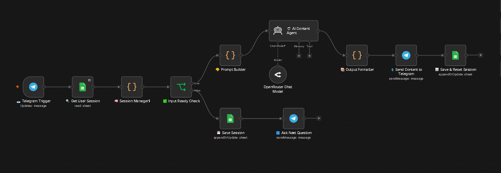
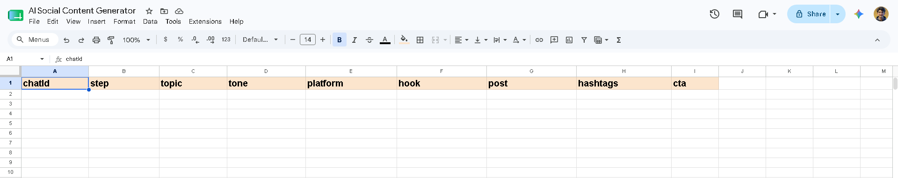

# AI Social Content Generator

## Overview
An intelligent Telegram bot powered by n8n that generates platform-optimized social media content packages using AI. Users interact conversationally through Telegram, providing a topic, tone, and target platform — the bot returns a complete content package including a hook, post, hashtags, and CTA, while logging everything to Google Sheets automatically.

---

## Problem
Content creators, marketers, and small business owners struggle to consistently produce quality social media content across multiple platforms. Writing platform-specific posts, crafting hooks, finding relevant hashtags, and adding strong CTAs is time-consuming and requires expertise most people don't have readily available.

---

## Solution
This n8n workflow acts as a personal AI content assistant living inside Telegram. It guides the user through a simple 3-step conversation to collect their topic, tone, and platform preference. Once collected, it sends the request to an AI model via OpenRouter, receives a structured content package, formats it beautifully, delivers it directly in Telegram, and saves the output to Google Sheets for future reference — all automatically.

---

## Tools Used
- **n8n** — workflow automation platform
- **Telegram Bot API** — user interface and content delivery
- **OpenRouter API** — AI model access (Google Gemini 2.5 Flash)
- **Google Sheets** — session storage and output logging
- **JavaScript** — custom logic in Code nodes

---

## Workflow Steps

1. **Telegram Trigger** fires on every incoming user message
2. **Google Sheets** is queried to retrieve the user's existing session by their chat ID
3. **Session Manager** reads the session, processes the current message, increments the step, and builds the next reply message
4. **IF node** checks if all inputs (topic, tone, platform) are collected
5. **False branch** — saves updated session to Google Sheets and sends the next question to the user via Telegram
6. **True branch** — Prompt Builder constructs a structured AI prompt from the collected inputs
7. **AI Content Agent** sends the prompt to Google Gemini 2.5 Flash via OpenRouter and receives a raw JSON response
8. **Output Formatter** parses the AI response, formats hashtags, and builds a clean HTML-formatted Telegram message
9. **Telegram node** delivers the final content package to the user
10. **Google Sheets** saves the full output (hook, post, hashtags, CTA) and resets the session for the next request

---

## Output
The user receives a fully formatted Telegram message containing:

```
✅ Your LinkedIn Content is Ready!

🎯 Topic: AI automation for small businesses
🎭 Tone: professional

🪝 Hook:
[Attention grabbing opening line]

📝 Post:
[Full platform-optimized post content]

#️⃣ Hashtags:
#AIAutomation #SmallBusiness #Productivity ...

📣 CTA:
[Strong call to action]

——————————————
💡 Send any message to generate new content!
```

Google Sheets simultaneously logs the full content package with topic, tone, platform, hook, post, hashtags, and CTA for every generation.

---

## Screenshots




---

---

## Key Learnings

- **Session management without a database** is one of the hardest challenges in stateless webhook-based workflows — Google Sheets proved to be a reliable and practical solution for self-hosted n8n
- **AI Agents in n8n** are far cleaner than raw HTTP Request nodes for LLM calls — they handle prompt formatting, response parsing, and model communication internally
- **Telegram bots** require careful message formatting — HTML parse mode gives full control over bold, italic, and line breaks
- **Prompt engineering matters** — instructing the model to return raw JSON only with no markdown or explanation was critical for reliable parsing
- **Workflow architecture decisions made early save hours of debugging later** — switching from HTTP nodes to AI Agent nodes resolved multiple cascading issues at once
- **Google Sheets as dual-purpose storage** (both session state and output logging) keeps the workflow lean without needing external databases
- **Professional workflows are built around the user experience first** — the Telegram conversation flow was designed to feel natural, not robotic
